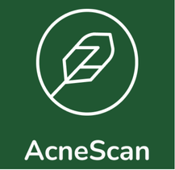

# AcneScan - Acne Detection App
Empowering Vulnerable Communities for Health and Well-being

## Table of Contents
1. [Introduction](#introduction)
2. [Problem Statement](#problem-statement)
3. [Solution Overview](#solution-overview)
4. [Features](#features)
5. [Project Scope & Deliverables](#project-scope--deliverables)
6. [Project Schedule](#project-schedule)
7. [Technical Stack](#technical-stack)
8. [Support Needed](#support-needed)
9. [Contributors](#contributors)
10. [References and Resources](#references--resources)

---

## Introduction

**AcneScan** is a mobile application aimed at addressing the widespread issue of acne by providing an AI-powered solution to detect acne and offer personalized skincare recommendations. By leveraging machine learning and image recognition technology, AcneScan transforms the skincare experience into a targeted and effective journey towards healthier skin.

---

## Problem Statement

Acne is one of the most common skin conditions affecting millions globally, leading to psychological distress, reduced self-esteem, and social anxiety. However, many individuals struggle to identify their skin's specific needs and the effectiveness of skincare products. The current trial-and-error process in skincare is ineffective and frustrating for many.

---

## Solution Overview

**AcneScan** tackles the problem by:
1. Using **image recognition technology** to detect and categorize different types of acne.
2. Providing **personalized skincare routines** based on individual skin types and conditions.
3. Empowering users with actionable insights for healthier skin.
4. Utilizing AI and machine learning to create a tailored, accessible, and user-friendly solution.

---

## Features

- **Instant Access**: Users can scan their skin without logging in.
- **Optional Login**: Users can create an account to save their skincare history.
- **Face Scanning Condition**: Detect acne severity and types via image analysis.
- **Skincare Recommendations**: Suggest personalized routines and face wash products.

---

## Project Scope & Deliverables

| **Week** | **Tasks** | **Deliverables** |
|----------|-----------|------------------|
| **Week 1** | - Create ERD - Design user interface in Figma - Draft project plan | - ERD - Figma UI designs - Project plan |
| **Week 2** | - Train initial ML model - Set up GCP integration - Develop login functionality | - Initial ML model - GCP integration - Login functionality |
| **Week 3** | - Finalize ML model - Build mobile app prototype - Submit Checkpoint 2 | - Optimized ML model - Mobile app prototype - Checkpoint 2 report |
| **Week 4** | - Unit and integration testing - Final testing, polishing, and documentation preparation | - Tested AcneScan app - Final documentation - Checkpoint 3 deliverables |

---

## Project Schedule

| **Milestone**          | **Start Date**   | **End Date**     |
|-------------------------|------------------|------------------|
| ERD Design             | Oct 26, 2024     | Oct 27, 2024     |
| UI/UX Design           | Oct 28, 2024     | Oct 29, 2024     |
| Initial ML Training     | Nov 2, 2024      | Nov 14, 2024     |
| GCP Integration         | Nov 2, 2024      | Nov 14, 2024     |
| Mobile App Prototype    | Nov 15, 2024     | Nov 23, 2024     |
| Testing and Polishing   | Nov 26, 2024     | Dec 10, 2024      |
| Final Deliverables      | Dec 12, 2024     | Dec 13, 2024     |

---

## Technical Stack

### Machine Learning (ML)
- **Tools**: Python (PyCharm, Jupyter Notebooks)
- **Libraries**: TensorFlow, CNN-related libraries
- **Resources**: Acne image datasets, GPUs/TPUs, image preprocessing tools

### Mobile Development (MD)
- **Tools**: Android Studio, Kotlin
- **Libraries**: ViewModel, NavigationFragment, DataBinding, Glide, Camerax, Retrofit, Coroutine, Room.
- **Resources**: Android emulators, Figma designs

### Cloud Computing (CC)
- **Tools**: Google Cloud Platform (GCP), Docker
- **Resources**: Golang, Docker CI/CD, database hosting, GCP APIs

---

## Support Needed

1. **Machine Learning**:
   - Mentor with expertise in CNN and image processing.
   - Access to high-quality labeled acne datasets across different skin tones, lighting conditions, and severity levels.

2. **Mobile Development**:
   - UI/UX design consultation for intuitive interfaces.
   - Guidance on deploying ML models on mobile devices.

3. **Cloud Computing**:
   - GCP credits (Cloud Storage, App Engine, Cloud Run, Cloud SQL, Artifact Registry).
   - Support for database hosting and scaling.

4. **Domain Expertise**:
   - Dermatological consultation for skincare recommendation validation.
   - Access to research papers and studies.

---
## Contributors
| **Name** |	**Role** |	
|------------------|------------------|
| M Fadhly Rafiansyah |	ML Engineer |
| Naufal Hadi D |	ML Engineer	|
| Zidan Dwi P | ML Engineer |
| M Akbar Permanaatmaja | Cloud Computing |
| Dimas Anugerah P | Cloud Computing |
| Deyan Laudza P | Mobile Developer |
| Hendrata Dewabrata | Mobile Developer |

## References & Resources
 - [ERD Diagram](https://colab.research.google.com/drive/1ua0q2qcxx7k9iddgfwSwHCLU7FDHRDwP?usp=sharing)
 - [UI Design on Figma](https://www.figma.com/design/6pa8JwsBA4gaSe44W9mFaR/CAPSTONE-KITA?node-id=1-4&t=rMoNEOXyFtX7Lft7-1)
 - [Training Notebook](https://drive.google.com/file/d/1uFfBO1LtWQiCZE-gWjOJ9yY2up6h7Wbf/view?usp=sharing)
